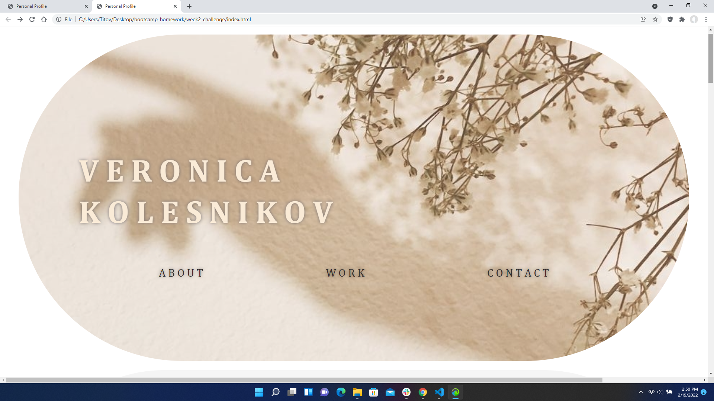
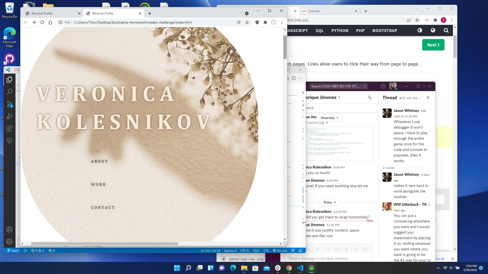
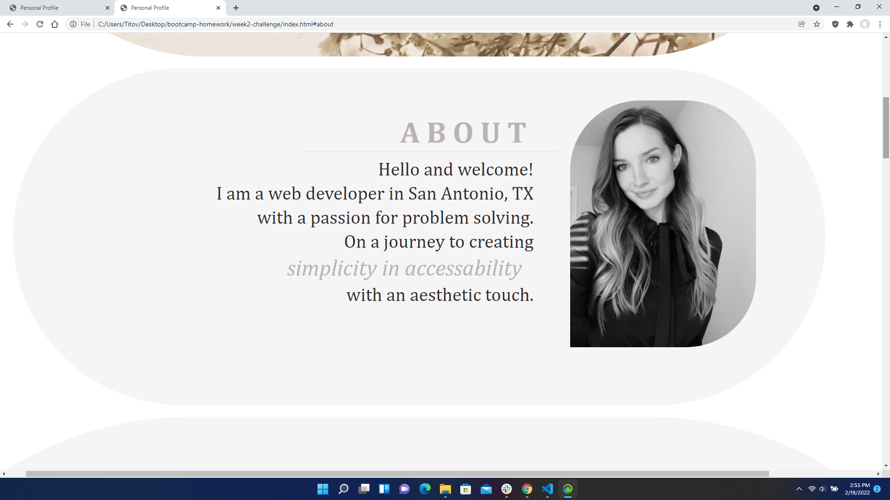
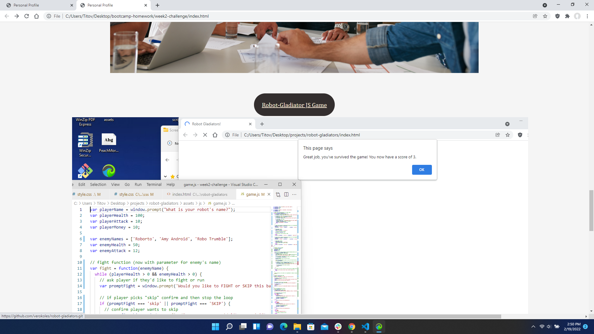
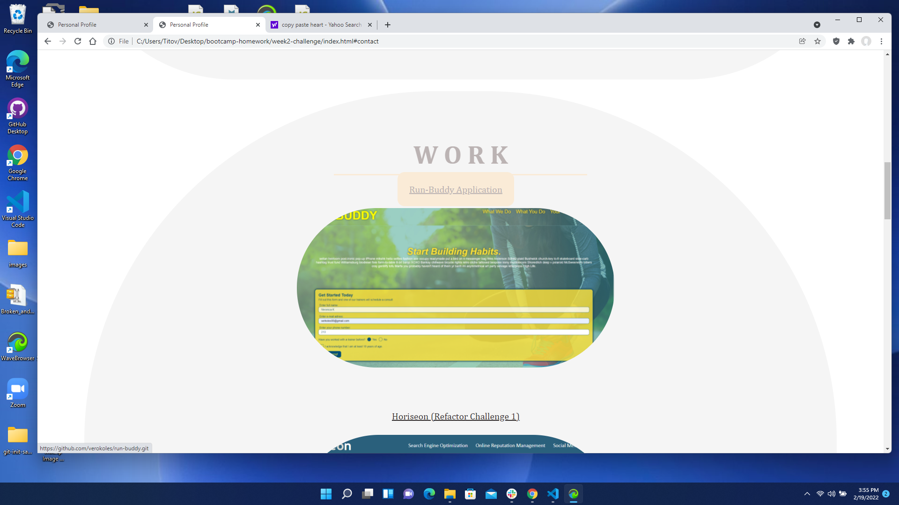
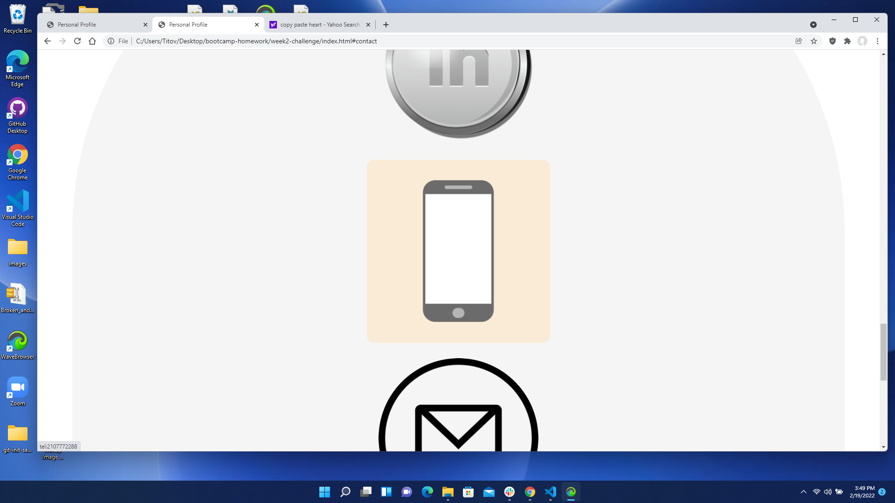
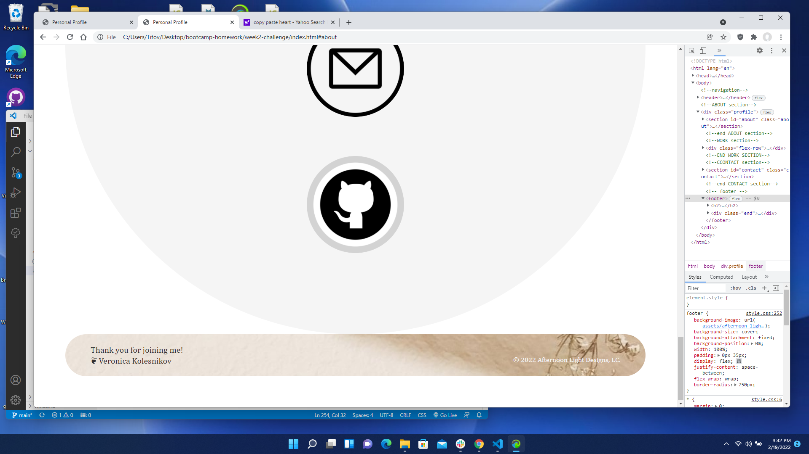

# VK Profile
 This page introduces me, the developer, in search of expanding my knowledge in web-development and progressing in my career.

## Purpose
 * Presenting a personal page that can eventually showcase the purpose, goals and previous work as a potential employee in full-time or part-time web development/coding. 

 ## Table of Contents:
1. [ Description ](#desc)
2. [ Built With ](#built-with)
3. [ Usage tips ](#usage)
4. [ Link to my page ](#link-to-my-page)
5. [ Helpful Links ](#help)

## 1. Description
 * If an employer were to see my profile, then they would be able to scroll through by clicking on the provided link(s), navigating easily through all the elements and correspnding destinations. 

 * If they were to click on my work, they would be able to see my projects and see a step-by-step process that goes along with it.

 * When an employer navigates down to the 'Contact' section, they should be able to hover over and choose a form of reaching out, whether it be email, phone number, or website platforms like Github.

## 2. Built With
 * HTML

 * CSS

## 3. Usage Tips
Formatting the cover banner photo, title(my name), and the headers uses < header> tags in HTML as well as < nav>, < ul>, and < li>, allowing the cursor to click on them.  

To ensure that this site satisfies all screen sizes, the declaration <meta name="viewport" content="width=device-width", initial-scale="1.0" /> is set to the top of the HTML page under the CSS link.

When they choose About, for example, the page automatically navigates, or jumps down to the section explaining my purpose and a photo of me. One trick to keeping the same theme of rounded edges was to apply the border radius property in CSS and set the pixels (px) higher the more rounder I wanted to go.

When working on the 'Work' section, the screenshots of the projects seemed way too large so they need to be wrapped in a < div class =" work- " > tag in HTML and set to .work-img{ } and .work-img img{} sections in CSS, setting the max-width and flex properties to fit the screen.

 

The section for reaching out to the future employer uses features like a:hover{} in CSS to style the button/box behavior when the cursor is hovering over. Once clicked, it prompts the image icon to direct into the form of contact (i.e email, Github, etc.)

An immense help comes from Chrome DevTools when it comes to changing styles, which wihtout it could be so tedious and take alot more time. The footer image wraps up the page and is able to be changed by clicking F12 and adjusted. And that goes for adjusting any section of the page!

## 4. Link to My Page!

To visit the porfolio, go to: [My Profile](https://github.com/verokoles/profile.git) 

## 5. Help Links

 * [W3 Schools on border-radius and styling](https://www.w3schools.com/css/css3_images.asp)
 * [Using CSS classes effectively](https://blog.mariano.io/css-utility-classes-how-to-use-them-effectively-d61ee00dad2d) 
 * [Media Queries](https://www.w3schools.com/css/css3_mediaqueries.asp) for viewing the site on different sized and pixel screens
 * [Navigation and tags](https://www.w3schools.com/TAgs/tag_nav.asp) to allow moving back and forth on a page more efficiently
 * Flexbox on [Free Code Camp](https://www.freecodecamp.org/news/an-animated-guide-to-flexbox-d280cf6afc35/) for a basic (and very helpful) guide on how to set up and organize any page

